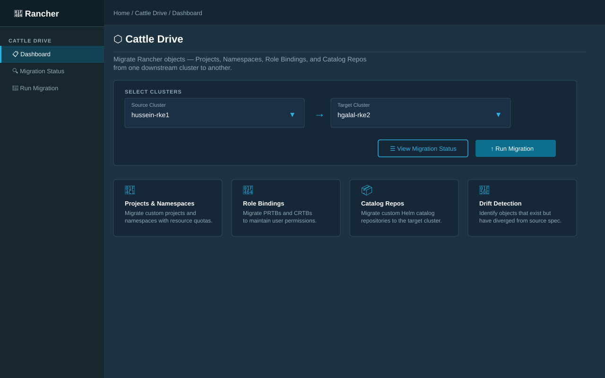
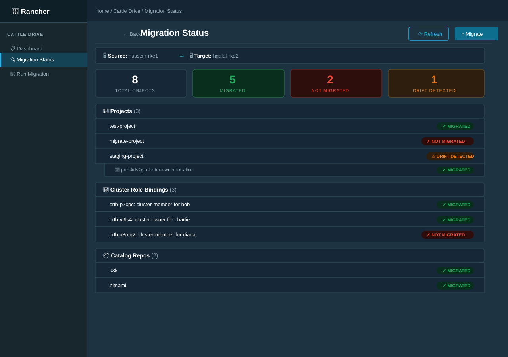
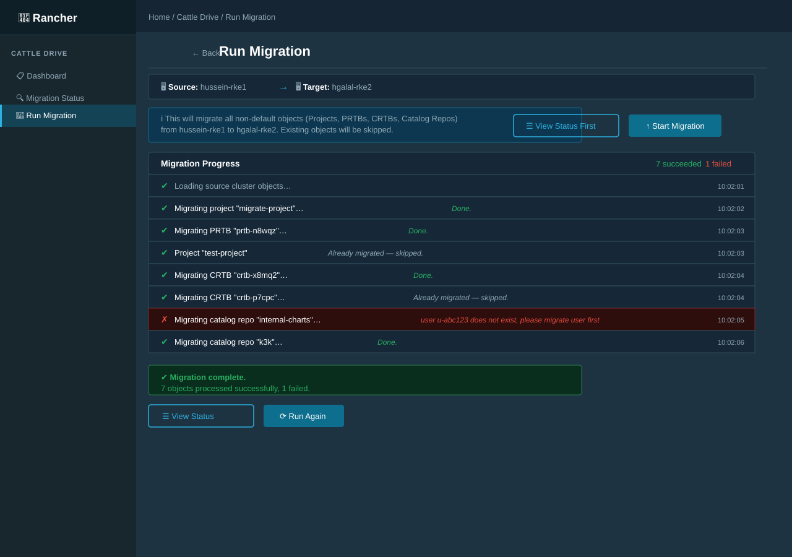

# cattle-drive

A tool to migrate Rancher objects created for downstream cluster from a source to a target cluster, these objects include, but not limited to:

- Projects
  - Namespaces
  - ProjectRoleTemplateBindings
- ClusterRoleTemplateBindings
- Cluster Apps
- Cluster Catalog Repos

## Usage

First you would need a kubeconfig that can connect to the local cluster of the Rancher environment with admin access, for more information on how to obtain this please visit the [docs](https://ranchermanager.docs.rancher.com/api/quickstart), the tool has 3 subcommands:

### Status

The status subcommand will list all the related objects and their status, the status can be one of three:

- Migrated
- Not Migrated
- Migrated but with wrong spec

```sh
$ cattle-drive status -s hussein-rke1 -t hgalal-rke2 --kubeconfig kubeconfig.yaml
Project status:
 - [test-project] ✔
  -> users permissions:
	 - [prtb-kds2g] ✔
  -> namespaces:
Cluster users permissions:
 - [crtb-p7cpc] ✔
 - [crtb-v9ls4] ✔
Catalog repos:
 - [k3k] ✔
```

### Migrate

The migrate subcommand will migrate all related objects to to the target downstream cluster, note that the some objects are only created on the local cluster while some objects has to be created on the downstream cluster itself.

```sh
$ cattle-drive migrate -s hussein-rke1 -t hgalal-rke2 --kubeconfig kubeconfig.yaml
Migrating Objects from cluster [hussein-rke1] to cluster [hgalal-rke2]:
- migrating Project [migrate-project]... Done.
```

### Interactive

The interactive subcommands allows you to navigate in a simple list menu through all the objects and their status, and allows you to migrate certain object individually.

[](https://asciinema.org/a/Bd6wc7pT0RM92sWqOctAanReL)

---

## Rancher UI Extension

The `ui-extension/` directory contains a [Rancher Dashboard UI Extension](https://github.com/rancher/ui-plugin-examples)
that surfaces the same functionality as the CLI tool directly inside the Rancher Manager web UI.
The extension communicates with a running **cattle-drive API server** (see below) rather than
calling Rancher APIs directly.

### API Server

Before using the UI extension you must start the cattle-drive HTTP API server on a host that can
reach the Rancher local cluster. For real Rancher installs, configure a default kubeconfig on the
server so UI requests do not need to send filesystem paths:

```sh
cattle-drive serve --listen 0.0.0.0:8080 --default-kubeconfig /var/lib/cattle-drive/kubeconfig.yaml
```

`--listen 0.0.0.0:8080` is convenient for local testing; for production, run it as an
in-cluster Service and expose it through Rancher's proxy path instead of direct public access.

This starts a lightweight HTTP server exposing three endpoints:

| Method | Path | Description |
|--------|------|-------------|
| `POST` | `/api/clusters` | List downstream clusters for a given kubeconfig |
| `POST` | `/api/status` | Compare source/target cluster objects, return migration status |
| `POST` | `/api/migrate` | Run full migration, return structured log |
| `GET`  | `/healthz` | Health check |

All endpoints accept and return JSON. A request may include a server-side `kubeconfig` path, but
when `--default-kubeconfig` is configured the field can be omitted. Example:

```sh
# List clusters
curl -s -X POST http://localhost:8080/api/clusters \
  -H 'Content-Type: application/json' \
  -d '{}' | jq .

# Get migration status
curl -s -X POST http://localhost:8080/api/status \
  -H 'Content-Type: application/json' \
  -d '{"source":"hussein-rke1","target":"hgalal-rke2"}' | jq .

# Run migration
curl -s -X POST http://localhost:8080/api/migrate \
  -H 'Content-Type: application/json' \
  -d '{"source":"hussein-rke1","target":"hgalal-rke2"}' | jq .
```

Cross-origin requests from the Rancher Dashboard are permitted via CORS headers. In production,
prefer running the API as an in-cluster service and calling it through Rancher's same-origin proxy:

`/k8s/clusters/local/api/v1/namespaces/cattle-system/services/http:cattle-drive-api:8080/proxy`

This lets browser requests use the existing Rancher authenticated session.

### Pages

| Page | Description |
|------|-------------|
| **Dashboard** | Connection settings (Rancher proxy API path + optional kubeconfig override), cluster picker, then navigate to Status or Migrate |
| **Migration Status** | Tree view of all migratable objects with per-object status badges (Migrated / Not Migrated / Drift Detected) and summary counters |
| **Run Migration** | Calls `POST /api/migrate` and renders the structured log |

### Screenshots

#### Dashboard — Connection Settings & Cluster Picker



#### Migration Status



#### Run Migration — Live Progress



### Extension structure

```
ui-extension/
├── index.ts                        # Extension entry point
├── product.ts                      # Product/sidebar registration
├── package.json                    # Extension metadata
├── babel.config.js
├── tsconfig.json
├── vue.config.js
├── routing/
│   └── extension-routing.js        # Vue Router routes
└── pages/
    ├── DashboardPage.vue            # Connection settings, cluster picker & feature overview
    ├── StatusPage.vue               # Migration status tree view (calls /api/status)
    └── MigratePage.vue             # Migration runner with log (calls /api/migrate)
```

### Installing the extension

1. Start the cattle-drive API server on a reachable host: `cattle-drive serve`
2. In Rancher Manager, go to the **local** cluster → **Apps** → **Repositories**.
3. Click **Create** and add this repository as a Git-based Helm repository.
4. Open the **Extensions** page and install the **cattle-drive** extension.
5. Expose the cattle-drive API server as a Service in the local cluster and use Rancher's proxy path.
6. In the extension **Dashboard**, keep the default Rancher proxy URL and (optionally) set a kubeconfig override.

### Developing locally

```sh
# Start the API server
cattle-drive serve --listen 0.0.0.0:8080

# From the rancher/dashboard repo root, with this repo checked out alongside it:
yarn install --frozen-lockfile
API=https://<your-rancher-host> yarn dev
# Open https://127.0.0.1:8005 — the extension hot-reloads on file changes.
```
